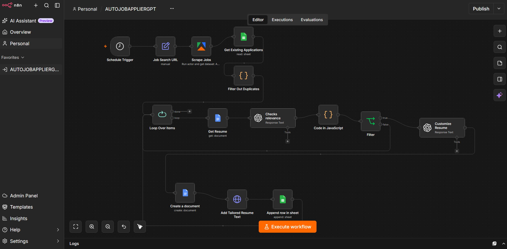

# 🤖 AutoJobApplierGPT — Autonomous Job-Matching & Resume-Tailoring Agent


An n8n workflow that watches LinkedIn for relevant AI/ML roles, filters out the ones that don't fit, and auto-generates a tailored resume for each match — all on a schedule, with zero manual triggering. 🕐✨

---

## 🚀 What It Does

Every 4 hours, the workflow:

1. 🔍 **Scrapes** fresh LinkedIn job postings matching a set of AI/ML search terms (AI Engineer, ML Engineer, Data Scientist, LLM Engineer, Generative AI) via an Apify actor.
2. 🧹 **Deduplicates** against a Google Sheets tracker so the same listing is never processed twice.
3. 🧠 **Screens each job with GPT-4o-mini**, which compares the job description against a base resume and returns a structured fit verdict (`true`/`false` + reasoning).
4. ✍️ **Tailors a resume with GPT-4o-mini** for every job that passes the relevance filter — rewriting and re-emphasizing real experience to match the job description (no fabricated content).
5. 📄 **Creates a new Google Doc** per job with the tailored resume, and **logs the job details + resume link** in a Google Sheets tracker for easy follow-up.

---

## 🏗️ Architecture



```
Schedule Trigger (every 4h)
   → Set LinkedIn search URL
   → Apify: Scrape LinkedIn Jobs
   → Google Sheets: Get existing applications
   → Code: Filter out duplicates
   → Loop over new jobs
       → Google Docs: Get base resume
       → OpenAI (GPT-4o-mini): Check relevance → {verdict, reason}
       → IF verdict == true
           → OpenAI (GPT-4o-mini): Tailor resume (HTML)
           → Google Docs: Create new doc
           → Google Drive API: Insert tailored resume text
           → Google Sheets: Append job + resume link to tracker
```

---

## 🧰 Tech Stack

| Layer | Tool |
|---|---|
| Orchestration | **n8n** |
| Job scraping | **Apify** (`linkedin-job-scraper` actor) |
| Relevance screening & resume tailoring | **OpenAI GPT-4o-mini** |
| Storage & tracking | **Google Docs / Sheets / Drive APIs** |

---

## 💡 Why I Built This

Manually screening job boards and rewriting a resume for every application doesn't scale. This workflow turns that into a background process: it only surfaces — and prepares materials for — jobs that are a genuine fit, based on an LLM comparison against my actual experience. Nothing invented, nothing exaggerated. 🎯

---

## ⚙️ Setup

1. Import `workflow.json` into your n8n instance.
2. Create credentials for: Apify, OpenAI, Google Docs, Google Sheets (OAuth2).
3. Replace the placeholder IDs in the workflow (marked `YOUR_...`) with your own:
   - Base resume Google Doc ID
   - Jobs tracker Google Sheet ID
   - Apify / OpenAI / Google credential references
4. Adjust the LinkedIn search keywords/location in the **Job Search URL** node to your target roles.
5. Activate the workflow. 🟢

> 🔒 Credential secrets themselves are never stored in the exported JSON — only credential *references* — which is why this is safe to keep in a public repo.

---

## 📌 Status

Personal project, actively in use for my own job search. 🧑‍💻
